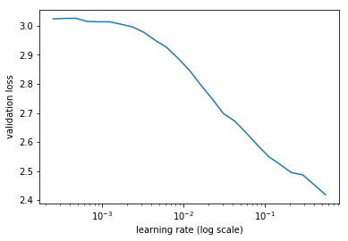
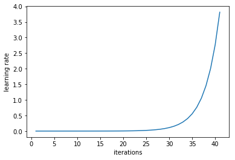
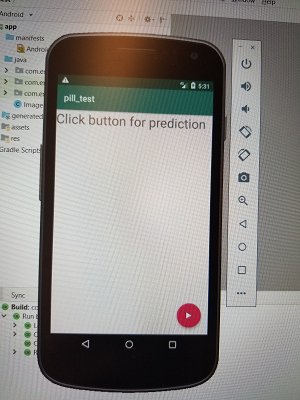
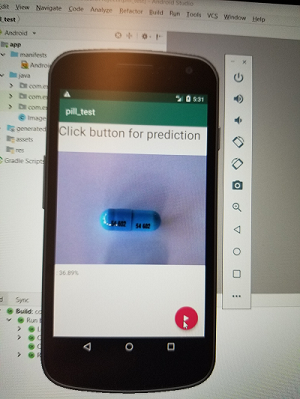
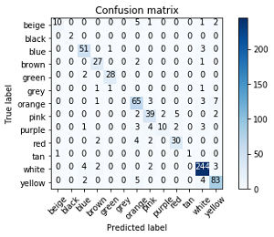
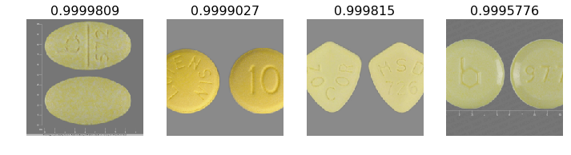
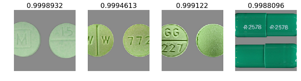
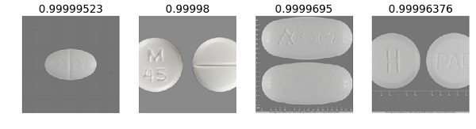
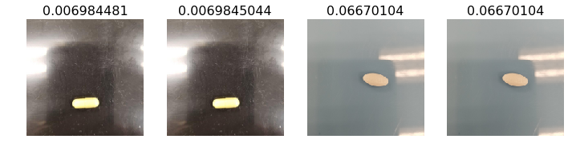
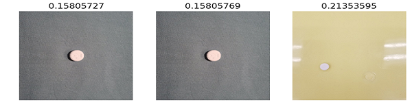

# Pill Identifier - Pill_ID
<div align="center">
Project for identifying prescription pills.  Current methods utitilize a drop down method where the user has to manually input the pill characteristics such as shape, color and imprint.
  
</div align>
<div align="center">
  
</div align>


Pillbox from the National Library of Medicine is a pill identifier portal that is representative of what is currently available in terms of identifying pills (https://pillbox.nlm.nih.gov/) It shows the use of the drop down menu.  There is no option for using pictures to help pre-populate the fields.

## Motivation

Patients particularly those over 50 are more likely to be prescribed more prescriptions, are more likely to store their medication in pill boxes, are more likely to have dexterity issues and may also have issues with eyesight.  This project is looking at a way to improve efficiency and accuracy by using images to help pre-populate input fields.

## Project format:

- **src** : Source code
- **tests** : Test model on specific image
- **data** : Example data
- **Android** : Code for Android deployment
- **Flask** : Code for Flask deployment
- **static** : README content and images

## Installation
Requirements for this project can be installed by creating the required environment using the `pillid.yml` file in the build folder

```
conda env create -f pillid.yml 
```

## Requisites
- Fastai
- Flask
- Android Studio

## Source Code
- train.py - train the data using the following parameters:
  - Learning rate of 0.01 (please view lr.py under Test as to why this learning rate was chosen)
  - Random Dihedral data augmentation (please view under analysis below)
  - Random Balance=0.2 and Contrast=0.8 data augmentation (please view under analysis below)
  - dropout = 0.25
  
```
python train.py
```

## Test
- cm.py - use to construct a confusion matrix
- lr.py - use to get the best learning rate for the data
<div align="center">
  
  
</div align>

When we compare the validation loss against the log learning rate (for an inital test set) we can see that the best learning rate is just prior to the curve leveling off at the bottom, in this case 0.01


- test.py - use this to test a pretrained model and set thresholds
```
python cm.py
```

## Run Inference
- infer.py - classification on a single image 
```
python infer.py
```

## Serve Model
- Two serving endpoints: Android and Flask
<div align="center">
  
  
</div align>

## Analysis
- Data augmentation using Random Dihyedral (this rotates the image by 90 degrees and/or flips images and adjusting balance and contract (this was to mimic images taken with a cell phone)
<div align="center">
  
</div align>

- Confusion matrix with respect to color representing 13 predicted labels on the x-axis and 13 true labels on the y-axis
<div align="center">
  
</div align>

- Confusion matrix with respect to shape
<div align="center">
  
</div align>

- Results showing most accurate and least accurate with respect to color.  The images that had the strongest color predictions are representative of images from the NLM database which are predominantly high resolution and sourced from the manufacturer.  These however are not representative of pictures that would be taken by an end user.

## Accurate
### Yellow
<div align="center">
  
</div align>

### Green
<div align="center">
  
</div align>

### White
<div align="center">
  
</div align>


## Inaccurate
### Yellow
<div align="center">
  
</div align>

### Green
<div align="center">
  
</div align>

### White
<div align="center">
  
</div align>


