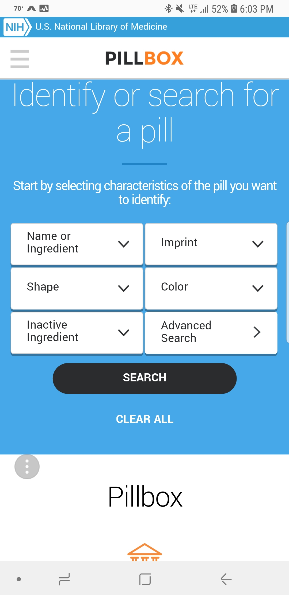
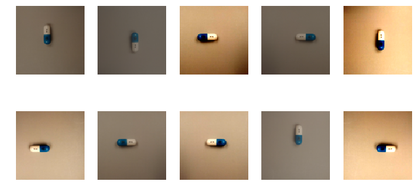

# Pill Identifier - Pill_ID
<div align="center">
Project for identifying prescription pills.  Current methods utitilize a drop down method where the user has to manually input the pill characteristics such as shape, color and imprint.
  
</div align>
<div align="center">
  
</div align>


Screenshot from the National Library of Medicine Pillbox pill identifier portal (https://pillbox.nlm.nih.gov/) that shows the current drop down menu for identifying pills.  There is no option for using pictures to help pre-populate the fields.

## Motivation

Patients particularly those over 50 are more likely to be prescribed more pills,have dexterity issues and may also have issues with eyesight.  This project is looking at a way to improve efficiency and accuracy by using images to help pre-populate input fields.

## Project format:

- **src** : Source code
- **tests** : Test model on specific image
- **data** : Example data
- **Android** : Code for Android deployment
- **Flask** : Code for Flask deployment
- **static** : README content and images

## Installation
Requirements for this project can be installed by creating the required environment using the `pillid.yml` file in the build folder

```
conda env create -f pillid.yml 
```

## Requisites
- Fastai
- Flask
- Android Studio

## Source Code
- train.py - train the data using the following parameters:
  - Learning rate of 0.01
  - Random Dihedral data augmentation
  - Random Balance=0.2 and Contrast=0.8 data augmentation
  - dropout = 0.25
  
```
python train.py
```

## Test
- cm.py - use to construct a confusion matrix
- lr.py - use to get the best learning rate for the data
- test.py - use this to test a pretrained model and set thresholds
```
python cm.py
```

## Run Inference
- infer.py - classification on a single image 
```
python infer.py
```

## Serve Model
- Two serving endpoints: Android and Flask
```
# Example

```

## Analysis
- Data augmentation using Random Dihyedral and adjusting balance and contract
<div align="center">
  
</div align>


- And/or include benchmarking of the model and results
```
# Example

# Step 1
# Step 2
```
